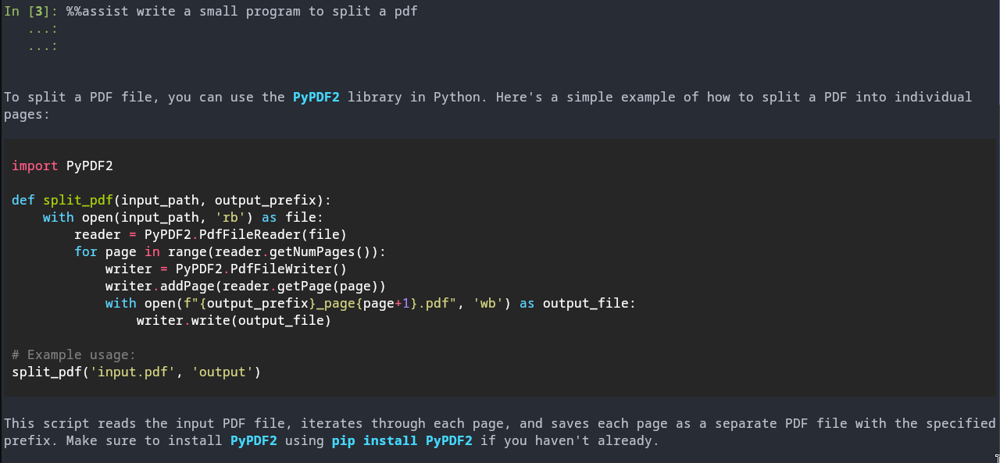

# Installation of dependencies
## Ollama
[Ollama](https://ollama.com) is used for downloading and serving a large number of llm packages. To install it follow the instructions given here https://ollama.com/download. If you are on linux and your Ollama is available in your distro's repository then you can install it through distro's package manager and set up a systemd service. For Arch linux the steps would be

```[bash]
$ sudo pacman -S ollama
```

## Python packages
To create the python environment do
```[bash]
pyenv virtualenv 3.11 ganga-ai
pyenv activate ganga-ai
pip install -r requirements.txt
```


## Docker
```[bash]
$ sudo pacman -S docker
```

Intialize the docker service
```
sudo systemctl enable docker.service
sudo systemctl start docker.service
```

Optionally cross check the documentation for your setup and see if you need to give docker more permissions (you need to on arch linux and I am assuming on other linux's too)
```
$ sudo groupadd docker
$ sudo usermod -aG docker $USER
```

If you have a gpu enable support for it so that your docker container can utilize it.
For nvidia
```
$ sudo pacman -S nvidia-container-toolkit
$ sudo nvidia-ctk runtime configure --runtime=docker
```

Test if the nvidia gpu is discoverable from docker via
```
$ docker run --gpus all nvidia/cuda:11.5.2-base-ubuntu20.04 nvidia-smi
```

# Configuration
To add your own config in `ganga-ai` directory put in a rc file. The default config is
```
MODEL = qwen3:8b
CONTEXT_WINDOW = 2048 # context window of the llm model
EMBEDDING_MODEL = BAAI/bge-small-en-v1.5 # the embedding model that will be used
DATA_URLS = https://github.com/ganga-devs/ganga # data urls that is used to build the rag
CACHE_DIR = cache # where the cache should be kept
DBNAME = rag # postrgress vector db name
USERNAME = cern # postrgress vector db username
PASSWORD = root # postgress vector db password
HOST = localhost # postgress host
PORT = 5432 # postgress port
TRANSFORMER_DIMENSION = 384 # dimensions of the embedding model
```

# Running the code
To run the code do
```[bash]
$ pyenv activate ganga-ai
$ ipython
$ %load_ext ganga_ai
$ %%assist <your query>
$ %%eval_rag # to see how the system is doing on some common tasks. The results can be seen in `eval_results.md`
```

On the first run the plugin builds a local rag and that takes a little time.

# Notes
1. The docker container's ollama tries to use the user's ollama models so that the app does not need to download the same model twice if it's already available. And if it is not then so that other apps can benefit from that original download too.
2. Markdown is supported


